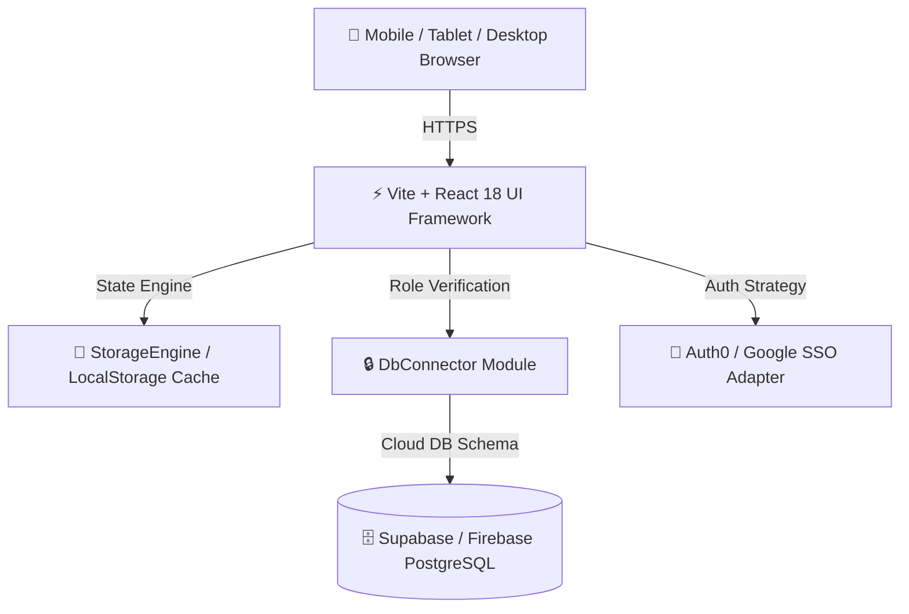
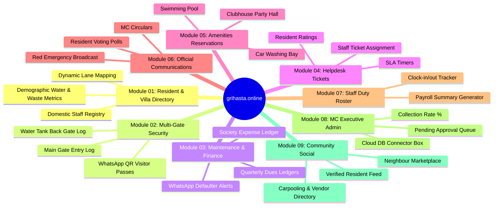

# 🏛️ Architecture & System Design Document
**Project:** Artha Grihasta Villa Layout Portal (`grihasta.online`)  
**Location:** Sonnur, Alambadi PO, Malur Taluk, Kolar, Karnataka 563160  
**Layout Parameters:** 40 Acres · 400 Villas/Plots · 15 Lanes  

---

## 1. Executive Summary & Goals

`grihasta.online` is an in-house digital layout management platform designed specifically for the Management Committee (MC) and residents of Artha Grihasta Layout in Malur, Kolar. The platform replaces fragmented WhatsApp groups, paper registers, and manual dues follow-ups with a unified, real-time web portal that works on any smartphone, tablet, or desktop browser.

---

## 2. Layout Specifications & Data Model

| Metric | Specification |
|---|---|
| **Total Layout Area** | 40 Acres |
| **Total Villa / Plot Units** | 400 Units (Plots 1 to 400) |
| **Master Lane Mapping** | 15 Lanes (Lane 1 to Lane 15) |
| **Plot Breakdown per Lane** | Lanes 1–14 (25 plots each) · Lane 15 (Plots 351–400) |
| **Demographic Baseline** | 2 Adults + 1 Child per Occupied Villa (Avg) |
| **Water Demand Model** | 135 L/day per Adult · 90 L/day per Child |
| **Garbage Output Model** | 0.4 kg/day per Adult · 0.25 kg/day per Child |

---

## 3. Technology Stack & Architectural Layers



### 3.1 Frontend & UX System
* **Framework:** React 18 + TypeScript 5 + Vite 8
* **Styling System:** Vanilla CSS (`src/index.css`) enforcing custom color tokens, fluid 1-column mobile grids (<768px), touch tap targets (40px+), and responsive touch table scrolling.
* **Icons:** `lucide-react` modern vector icons.

### 3.2 Security & Access Control Architecture
* **Access Groups (3 Portals / 6 RBAC Roles):**
  1. 👑 **Management & Committee:** `MC_ADMIN` (Full Admin), `MC_MEMBER` (Elevated Admin)
  2. 🏡 **Resident Portal:** `RESIDENT_OWNER` (Owner View), `RESIDENT_TENANT` (Tenant View)
  3. 🛡️ **Operations & Staff:** `SECURITY_GUARD` (Gate Log), `MAINTENANCE_STAFF` (Duty Tickets)
* **Strict Role Enforcement:**
  * MC Members **cannot self-assign** elevated privileges. Residents register with Name, Phone, Villa #, and Occupancy Status (`Owner Occupied` vs `Rented`).
  * MC Members review and approve requests via the 1-Click Access Request Queue in Module 08.

---

## 4. 9 Core Functional Modules



---

## 5. Auth0 & Cloud Database Integration Strategy

### 5.1 Auth0 SSO Authentication Setup
* **Domain Strategy:** `grihasta.us.auth0.com`
* **Connections:** Google Workspace (Gmail IDs), Mobile OTP, and Username/Password.
* **First Login Reset:** MC Members log in with assigned Gmail credentials (`test@test.com` temporary testing) and reset password on first login.

### 5.2 PostgreSQL Database Schema (Supabase / Firebase)
```sql
-- Villas Master Directory
CREATE TABLE villas (
    id VARCHAR(50) PRIMARY KEY,
    flat_number VARCHAR(50) NOT NULL UNIQUE,
    block_lane VARCHAR(50) NOT NULL,
    owner_name VARCHAR(100) NOT NULL,
    owner_phone VARCHAR(20) NOT NULL,
    owner_email VARCHAR(100),
    tenant_name VARCHAR(100),
    tenant_phone VARCHAR(20),
    occupancy_type VARCHAR(30) CHECK (occupancy_type IN ('Owner Occupied', 'Rented', 'Vacant')),
    quarterly_dues_rate NUMERIC(10,2) DEFAULT 9000.00,
    adults_count INT DEFAULT 2,
    kids_count INT DEFAULT 0
);

-- Pending Access Approvals
CREATE TABLE access_requests (
    id VARCHAR(50) PRIMARY KEY,
    name VARCHAR(100) NOT NULL,
    mobile VARCHAR(20) NOT NULL,
    villa_number VARCHAR(50) NOT NULL,
    occupancy_type VARCHAR(30) NOT NULL,
    requested_role VARCHAR(50) NOT NULL,
    status VARCHAR(20) DEFAULT 'Pending' CHECK (status IN ('Pending', 'Approved', 'Rejected')),
    submitted_at DATE DEFAULT CURRENT_DATE
);
```
