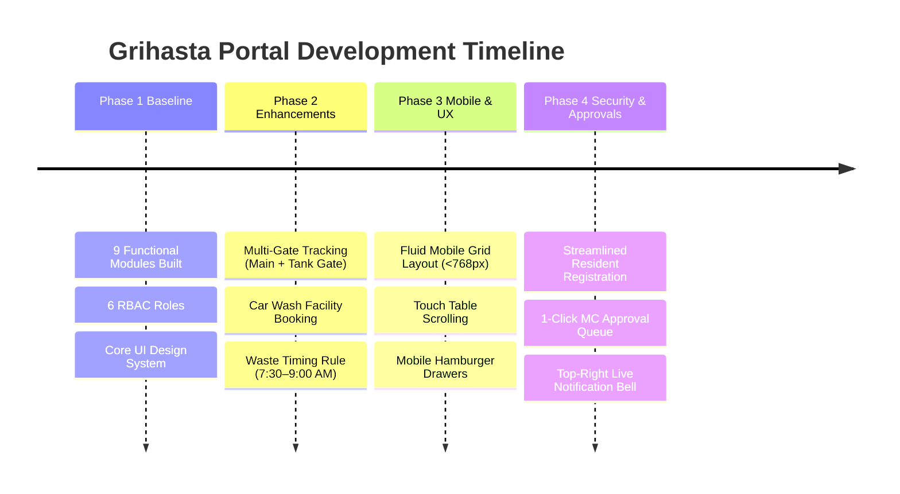

# 🚀 Progress & Completed Work Log
**Project:** Artha Grihasta Villa Layout Portal (`grihasta.online`)  
**Last Updated:** August 2026  

---

## 1. Summary of Milestones Achieved

---

## 2. Key Completed Features & Enhancements

### 🏘️ 1. Villa Master Directory & Lane Auto-Mapping (`Module01_Flats.tsx` & `laneMapping.ts`)
- Mapped 400 Villas/Plots across 15 Lanes (`Lane 1` to `Lane 15`).
- System dynamically detects entered villa number (e.g. `Villa 306` ➔ `Lane 13`) and displays auto-mapped lane.
- Standardized **Add Villa / Plot Record** form to match the 4-field registration format:
  1. Full Resident Name
  2. Mobile Number
  3. Villa / Plot Number
  4. Occupancy Status (`Owner Occupied` vs `Rented`)
- Added adult & child demographic tracking with automated daily layout water demand (L/day) and waste output (kg/day) metrics.

### 🛡️ 2. Multi-Gate Security Tracking & Visitor Passes (`Module02_Gate.tsx`)
- Added gate selection tracking for **Main Entrance Gate** and **Water Tank Back Gate**.
- Pre-approved visitor pass generator with digital QR preview and 1-click WhatsApp share link.

### 🏊 3. Amenities Reservations & Car Wash Bay (`Module05_Amenities.tsx`)
- Added **Car Washing Facility / Bay** reservation system.
- Time-range collision detection preventing double-bookings.

### 📋 4. Rules & Waste Management Governance (`ManualModal.tsx`)
- Updated vehicle parking rule restricting layout driveway parking.
- Configured waste segregation rule: **Collection timing between 7:30 AM and 9:00 AM daily**.
- Added dynamic **➕ Add New Guideline Rule** generator for MC members with local storage persistence (`grihasta_guidelines_v1`).
- Restricted timing edit rights strictly to MC members (`MC_ADMIN`, `MC_MEMBER`).
- Removed legacy manual links and discussion note boxes.

### 📱 5. Mobile & Tablet Responsiveness Overhaul (`index.css` & `LandingPage.tsx`)
- Enforced mobile-first fluid CSS grid rules collapsing `grid-2`, `grid-3`, `grid-4` to 1 column on phones (<768px).
- Embedded touch scrolling (`-webkit-overflow-scrolling: touch`) for all data tables.
- Added touch-friendly tap targets (40px+ height) and slide-down mobile hamburger drawers.

### 🔒 6. Registration & MC One-Click Approval Flow (`LoginModal.tsx` & `dbConnector.ts`)
- Created **First-Time Resident Registration** form (Name, Mobile, Villa #, Occupancy Status).
- Implemented **⚡ Pending Access Request Approval Queue** in Module 08 with 1-click `✅ Approve` and `❌ Reject` buttons.
- Approving a request automatically synchronizes and updates the resident into the 400-Villa Directory (`StorageEngine.saveFlats()`).

### 🔔 7. Top-Right Live Notification Bell System (`Navbar.tsx`)
- Added top-right **🔔 Notification Bell** with red dynamic badge counter (e.g. `🔔 3`).
- Displays live dropdown overlay listing pending access approval requests with 1-click navigation to Module 08.
- Ensures the **Login button is automatically hidden when logged in**, showing only the **`🚪 Sign Out`** button.

### 🔑 8. MC Temporary Testing Credentials
- Implemented temporary MC testing login:
  - **Email:** `test@test.com`
  - **Password:** `test`
- Prepared Auth0 SSO adapter for tomorrow's Gmail ID password reset transition.

---

## 3. Git Commit History Summary

| Commit Hash | Description |
|---|---|
| `bd447d4` | Initial repository baseline & Phase 2 roadmap center |
| `b158e19` | Added multi-gate security tracking & car wash booking facility |
| `13d0a2c` | Updated resident guidelines, waste timings, and lane mapping |
| `93ca365` | Grouped 3-tier access portals & added 1-click home navigation |
| `7e18ed7` | Cleaned up manual modal, removed legacy links and notes |
| `c56f822` | Comprehensive mobile & tablet responsiveness transformation |
| `1a887ac` | Added Resident Access Request modal & MC Approval Queue |
| `57fef37` | Implemented temporary MC login authentication (`test@test.com` / `test`) |
| `95ac350` | Streamlined login modal UI |
| `42d883e` | Updated Login Modal with Auth0 sign in & registration flow |
| `98f4e99` | Cleaned up registration info banner text |
| `410366e` | Architectural fix: Hide Login button when logged in & auto-sync approved users |
| `46837a2` | Standardized Add Villa form & added top-right notification bell dropdown |
